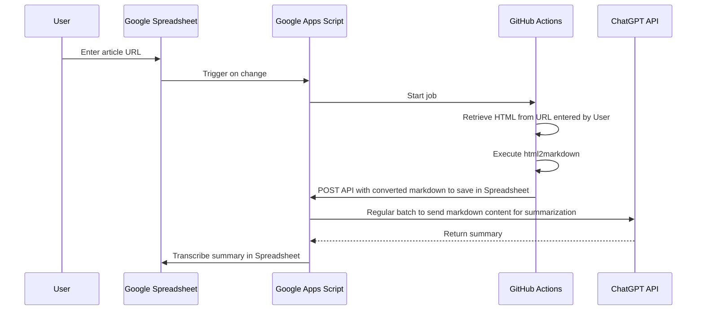

# webpage-summarizer

[](LICENSE)

System for summarizing the content of webpages by analyzing their HTML. Easily extract key information from any webpage and view it in a condensed format.

## Sequence Diagram



## Directory Structure

```sh
tree . -I node_modules
.
├── LICENSE
├── README.md
├── html2markdown
│   ├── README.md
│   ├── package.json
│   ├── src
│   │   └── main.ts
│   ├── tsconfig.json
│   └── yarn.lock
└── webpage-summarizer
    ├── README.md
    ├── package-lock.json
    ├── package.json
    ├── src
    │   ├── apis
    │   │   ├── do-get.ts
    │   │   └── do-post.ts
    │   ├── appsscript.json
    │   ├── clients
    │   │   ├── chatgpt-client.ts
    │   │   └── github-client.ts
    │   ├── jobs
    │   │   ├── invoke-html-to-markdown.ts
    │   │   └── summarize.ts
    │   └── modules
    │       ├── auth.ts
    │       ├── fetch-from-spreadsheet.ts
    │       ├── fetch-target-urls.ts
    │       ├── filter-latest-summaries.ts
    │       ├── log-error.ts
    │       ├── schema.ts
    │       └── setup.ts
    ├── tools
    │   ├── deploy.sh
    │   └── open.sh
    └── tsconfig.json

9 directories, 27 files
```

## Setup

Folk this repository and clone it.

```sh
# example
git clone git@github.com:${YOUR_GITHUB_USER_NAME}/webpage-summarizer.git
```

### Google Apps Script

1. Install clasp

```sh
npm install -g @google/clasp
```

2. Enable the Google Apps Script API: https://script.google.com/home/usersettings
3. Execute below commands

```sh
cd webpage-summarizer
npm install

clasp login
clasp create --title "webpage-summarizer" --type sheets --rootDir ./src
clasp push --force
clasp open
```

4. Set environment variables

- required
  - `GITHUB_OWNER`: Your GitHub username
  - `GITHUB_REPO`: Your GitHub repository name
  - `GITHUB_TOKEN`: Your GitHub Personal Access Token
  - `GITHUB_WORKFLOW_ID`: Your GitHub Actions workflow ID
  - `OPENAI_API_KEY`: Your OpenAI API Key
  - `WEBPAGE_SUMMARIZER_API_KEY`: Any string you generate for easy authentication in Google Apps Script
    - This used for authentication when you access below `WEBPAGE_SUMMARIZER_API_URL`

5. Prepare spreadsheet as follows

- `summaries` sheet
  - content (string)
  - summary (string)
  - url (string)
  - date (string)
- `prompts` sheet
  - instruction (string)
    - Write your own prompts for ChatGPT API.
  - constraints (string)
    - Write your own prompts for ChatGPT API.
- `latest_summaries` sheet
  - summary (string)
  - url (string)
  - date (string)
- `error_logs` sheet

6. Publish API
7. Copy your Web App URL (`WEBPAGE_SUMMARIZER_API_URL`) and `WEBPAGE_SUMMARIZER_API_KEY`
8. Set triggers by executing `setUp` function on Google Apps Script

### GitHub Actions

Add below secrets to your repository.

- required
  - `WEBPAGE_SUMMARIZER_API_KEY`: Your Web App API Key (see above)
- optional
  - If you want to use webpage-summarizer only for yourself, add below secret. This secret is used as a default endpoint.
    - `WEBPAGE_SUMMARIZER_API_URL`: Your Web App URL (see above)
  - If you want to use webpage-summarizer with multiple users, add below secrets.
    - `USERS_INFO_URL`: API endpoint for getting GAS Web App URL associated with a target user
      - This API endpoint returns JSON with `url` field which is GAS Web App URL associated with a target user or null.
    - `USERS_INFO_API_KEY`: Any string you generate for easy authentication in Google Apps Script
      - This used for authentication when you access `USERS_INFO_URL`
